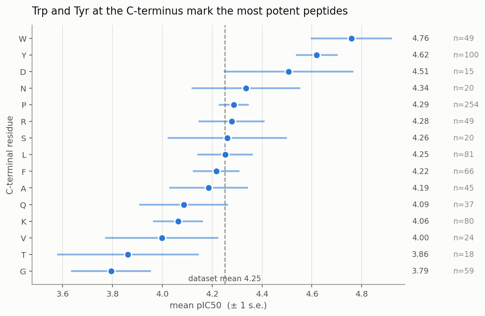
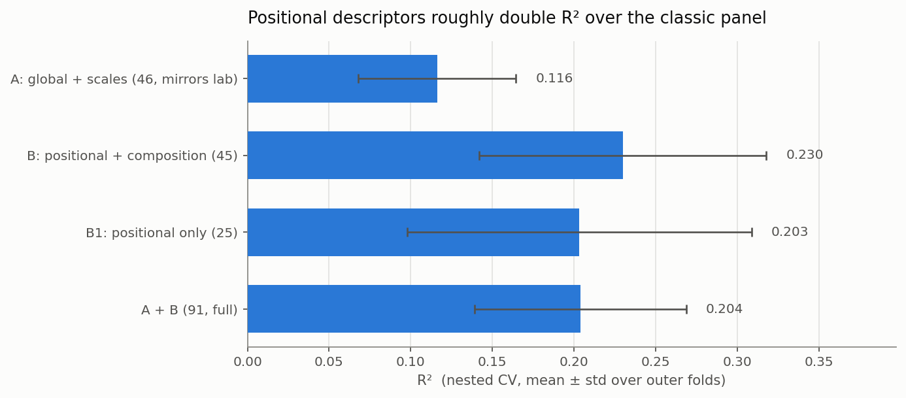
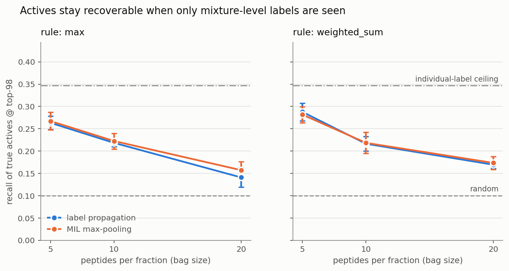

# Interpretable Prediction of ACE-Inhibitory Peptide Bioactivity

Predicting the potency of food-derived ACE-inhibitory (antihypertensive) peptides from
physicochemical descriptors, with an emphasis on **which descriptors actually carry signal**
and on the case where bioactivity is measured on **mixtures rather than individual peptides**.

Every number below is produced by `python run_all.py` and read from `results/`.
Nothing is hand-copied.

---

## 1. Problem

Bioactive peptides are released when food proteins are hydrolysed. Screening them
experimentally is slow, so the practical question is: *given a few hundred peptides, which
15 do you send for synthesis?*

Two complications make this harder than a standard QSAR exercise, and both are addressed here:

1. **Descriptors are strongly correlated**, so feature-importance estimates are unstable —
   SHAP and Lasso can disagree sharply about which descriptors matter.
2. **Activity is often assayed on chromatographic fractions**, i.e. mixtures of many peptides,
   while the deliverable is a ranking of *individual* peptides. This is a
   multiple-instance learning problem in disguise.

## 2. Data

**Source:** [AHTPDB](https://webs.iiitd.edu.in/raghava/ahtpdb/) — manually curated,
experimentally validated antihypertensive peptides.
Cite: Kumar et al. (2015) *Nucleic Acids Research* 43:D956-65.

The raw file is **not redistributed**; `src/data.py` downloads it.

| Step | Rows |
|---|---|
| raw records | 3364 |
| usable, uncensored IC50 | 2697 |
| dropped — censored (`>1500 μM`) | 574 |
| dropped — IC50 reported as zero | 48 |
| dropped — unparseable unit | 24 |
| dropped — inhibition % not a concentration | 21 |
| non-standard residues | 0 |
| **unique peptides after aggregation** | **977** |

Cleaning handles the traps in this file: two different Unicode micro signs (U+03BC and
U+00B5), units spanning μM / mM / μg·ml⁻¹ / mg·ml⁻¹ (the mass units converted via molecular
weight), and value ranges (midpoint taken). Target is `pIC50 = -log10(IC50 [M])`,
spanning **0.46 – 8.00** (median 4.24). Peptide length runs 2 – 50 residues (median 5).
Sources are food-derived: milk, fish, cereals, casein, soybean, wakame, meat, legume.

### How good can any model be here?

565 peptides have more than one independent measurement, so the label noise is measurable.
A split-half reliability analysis gives Pearson *r* = 0.844 between disjoint halves,
and a Spearman–Brown correction to full length gives reliability 0.916.

> **The measurement ceiling on R² is ≈ 0.84.**

This matters: it says the labels are *not* the binding constraint, so any weak result is a
statement about the features, not an excuse about noisy data. Replicate disagreement is
nonetheless heavy-tailed (90th percentile spread 31.6× in concentration), and the
per-peptide spread is retained in the processed data as a quality flag.

## 3. Descriptors

91 descriptors per peptide, in two deliberately separated blocks (`src/features.py`,
computed with [`peptides`](https://github.com/althonos/peptides.py)):

- **Block A — 46 whole-sequence descriptors**, mirroring the classic panel: 9 global
  (length, MW, charge, pI, hydrophobicity, hydrophobic moment, aliphatic index,
  instability index, Boman) + 37 from five scale families (Kidera, Z-scales, VHSE,
  Cruciani, FASGAI, T-scales).
- **Block B — 45 positional/compositional descriptors**: per-residue Z-scales at the three
  C-terminal and two N-terminal positions (25), plus amino-acid composition (20).

Block B exists because of the biology. ACE inhibition is known to be driven by the
C-terminal residues, and a whole-sequence average *cannot express* "the last residue is
tryptophan". Sorting the dataset by C-terminal residue reproduces the published
structure–activity relationship directly from the data:

| C-terminal residue | W | Y | P | F | L | K | V | T | G |
|---|---|---|---|---|---|---|---|---|---|
| mean pIC50 | 4.76 | 4.62 | 4.29 | 4.22 | 4.25 | 4.06 | 4.00 | 3.86 | 3.79 |



Trp and Tyr at the C-terminus are the most potent; Gly the least. This is the classic
ACE-inhibitory SAR, recovered from the data without being told.

## 4. Models and validation

Five model families plus a mean baseline (`src/models.py`), all under **nested
cross-validation** — outer 5-fold for the estimate, inner 3-fold for hyperparameters,
fixed seed. Reported as mean ± std across outer folds (`src/evaluate.py`).

| Model | R² | RMSE | Spearman ρ |
|---|---|---|---|
| Baseline (mean) | −0.018 ± 0.021 | 1.011 ± 0.028 | 0.000 ± 0.000 |
| Lasso | 0.079 ± 0.070 | 0.961 ± 0.025 | 0.294 ± 0.083 |
| ElasticNet | 0.094 ± 0.071 | 0.953 ± 0.025 | 0.304 ± 0.091 |
| BayesianRidge | 0.105 ± 0.073 | 0.947 ± 0.026 | 0.315 ± 0.087 |
| **RandomForest** | **0.204 ± 0.065** | **0.893 ± 0.039** | **0.459 ± 0.051** |
| HistGradientBoosting | 0.199 ± 0.084 | 0.895 ± 0.039 | 0.441 ± 0.058 |
| *RandomForest, y shuffled* | *−0.043 ± 0.042* | | |

The shuffled-target control sits at ≈ 0, confirming the pipeline does not leak.

### Which descriptors carry the signal?

| Block | n | R² | Spearman ρ |
|---|---|---|---|
| A — whole-sequence panel | 46 | 0.116 ± 0.048 | 0.339 |
| **B — positional + composition** | 45 | **0.230 ± 0.088** | **0.461** |
| B1 — positional only | 25 | 0.203 ± 0.105 | 0.429 |
| A + B (headline model) | 91 | 0.204 ± 0.065 | 0.459 |



**Positional encoding roughly doubles R² over the classic whole-sequence panel.**
Block B alone edges out the full set, though the error bars overlap; the headline model
uses the full pre-specified A + B set rather than the post-hoc best block, to avoid
selecting features on the same CV used to report performance.

Absolute performance stays well under the 0.84 measurement ceiling. The honest reading:
sequence-level descriptors capture part of ACE inhibition, but a substantial share depends
on binding geometry that these features do not encode.

## 5. Interpretation

Of 4095 descriptor pairs, **23 exceed |r| > 0.9** — enough to destabilise attribution.
The consequence is visible directly:

| Rank | SHAP (mean abs.) | Stability selection |
|---|---|---|
| 1 | molecular_weight | Nt1_Z3 |
| 2 | Nt_Z1 | Nt_Z1 |
| 3 | Ct2_Z1 | hydrophobic_moment |
| 4 | VHSE5 | Ct2_Z3 |
| 5 | F6 | Nt_Z4 |

**The two rankings share exactly one descriptor.** SHAP explains *this fitted model*, and
when descriptors are collinear it can spread credit arbitrarily among near-duplicates.
Stability selection (500 bootstrap Lasso fits across a regularisation path,
`src/interpret.py`) instead asks how often a descriptor is chosen at all — a question that
survives collinearity. Reporting only one of the two would misrepresent the evidence; the
agreement between them (terminal-residue Z-scales appear in both) is the part worth trusting.

### Shortlist

15 candidates ranked by out-of-fold prediction, so every peptide is scored by a model that
never saw it (`results/tables/shortlist.csv`):

- shortlist mean true pIC50 **5.32** vs dataset mean **4.25**
- precision at the top decile: **40%** vs **10%** for random selection — **4× enrichment**

## 6. Fraction-level (mixture) labels

The experiment that mirrors the real constraint. Peptides are pooled into synthetic
fractions; **only the fraction-level label is shown to the model**; individual peptides are
then ranked and scored against the held-back individual truth (`src/mixtures.py`).
Two label rules: `max` (one dominant peptide) and `weighted_sum` (potencies add in
concentration space). Two methods: naive label propagation, and MIL with max-pooling by
alternating optimisation (each round the model picks a "witness" peptide per fraction).

Actives are the top decile (98 of 977, pIC50 ≥ 5.53); recall is measured at top-98.

| Rule | Bag size | Propagate | MIL max-pool |
|---|---|---|---|
| max | 5 | 0.263 ± 0.015 | 0.267 ± 0.020 |
| max | 10 | 0.218 ± 0.008 | 0.222 ± 0.018 |
| max | 20 | 0.141 ± 0.022 | 0.157 ± 0.019 |
| weighted_sum | 5 | 0.288 ± 0.020 | 0.282 ± 0.018 |
| weighted_sum | 10 | 0.216 ± 0.016 | 0.218 ± 0.024 |
| weighted_sum | 20 | 0.169 ± 0.008 | 0.173 ± 0.014 |
| *random baseline* | | *0.100* | |
| *individual-label ceiling (OOF RandomForest)* | | *0.347* | |



The ceiling row is the same model trained on **individual** labels — the fair reference,
since no mixture-level method can be expected to beat it.

> **Training on fraction labels alone recovers 0.282 of the actives — 81% of the
> individual-label ceiling, and 2.8× random — without ever seeing an individual label.**

Recovery degrades smoothly as fractions grow larger and more dilute (0.267 → 0.157 from
bag size 5 to 20). MIL max-pooling gives only a marginal edge over naive label propagation
here, which is worth stating plainly rather than dressing up: at these bag sizes the
propagation baseline is already close to what the witness-selection scheme finds.

## 7. Limitations

- Literature-aggregated IC50 values span decades and assay protocols; replicate
  disagreement reaches 31.6× at the 90th percentile.
- 574 censored values were dropped, which removes much of the weakly-active range and
  likely makes the task look easier than a full-range assay would.
- Synthetic fractions are random pools; real chromatographic fractions group peptides by
  physicochemical similarity, which would make attribution harder.
- Descriptors are sequence-level only — no structural or docking information.
- Random-split CV can place near-duplicate sequences in both train and test; a
  similarity-grouped split would give a stricter estimate.

## 8. Reproduce

```bash
python3 -m venv .venv && ./.venv/bin/pip install -r requirements.txt
./.venv/bin/python run_all.py
```

Downloads the data, rebuilds every table in `results/tables/` and every figure in
`results/figures/`. Fixed seeds throughout; two runs give identical output.

```
src/data.py        download + clean + aggregate replicates
src/features.py    91 descriptors in two blocks
src/models.py      model zoo + hyperparameter grids
src/evaluate.py    nested CV + feature-block ablation
src/interpret.py   SHAP, stability selection, shortlist
src/mixtures.py    fraction-level label recovery
src/plots.py       headline figures
```
